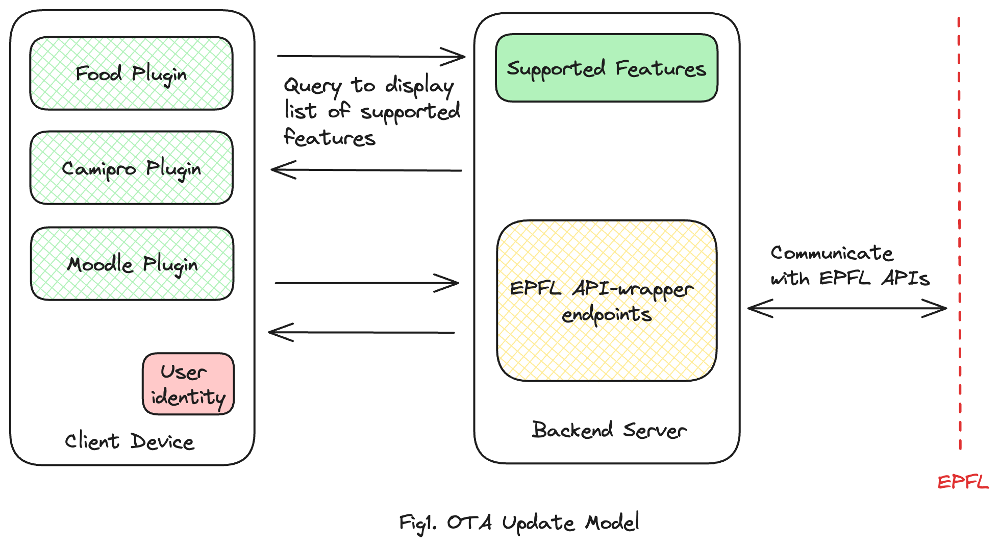

### Non-functional requirements

We document the non-functional requirements that the MVP must satisfy to make it _viable._

## Security, privacy, and data retention policies

### Security and Trust

EPFL services are guarded by Tequila (which is EPFL's OAuth2.0 system). Since our servers will be communicating with EPFL servers on the user's behalf, we must ensure that we do not save any user credentials on the backend (such as passwords or refresh tokens).

### Privacy Considerations

As we plan to support printing, our server should only serve as a job submitting middleware and not save files of users since they could be private. Moreover, our backend should be so designed that we should not save/extract or infer any personally identifiable information about a user, such as Name, Age, Gender, Address, etc.

### Data Retention Policy

In the eyes of our real customer (EPFL IT), we should be viewed simply as an information facilitator. This means that we need to keep a strict and well-defined policy around what user data we retain. For example, in the context of the food menu, our app could be viewed as favoring some cafeterias/food trucks over others if we collect and retain all the menus and user preferences to send them targeted ads. Moreover, for Moodle, we should not retain course assignments, handouts, and other material beyond the semester. Therefore, we should define clear data retention policies, like deleting food menus older than 30 days.

## Adoption, Scalability, and Availability

#### Adoption

1. The application must, by default, have all push notifications disabled to avoid unnecessary digital distractions for the users.
2. Users should have the option to selectively enable push notifications for specific functionalities within the app, such as low camipro balance.
3. The application's user interface must include easily accessible settings for customizing notification preferences.
4. Adoption metrics must focus on user engagement quality rather than frequency, emphasizing the app's value-add to the users' experience.

#### Scalability

1. The application must be capable of scaling resources automatically to accommodate fluctuating user loads, particularly during peak academic periods.
2. The system should maintain optimal performance and response times, even under high traffic conditions, as defined by peak usage metrics (lunch time, exam period, etc.).
3. Scalability solutions must include database read-replicas and backend load balancing capabilities to ensure resource efficiency and service continuity.

#### Availability

1. The application must achieve a minimum uptime of 99.9%, ensuring consistent availability to users.
2. Implement comprehensive failover mechanisms to handle potential system disruptions, including power, network, and hardware failures.
3. Regular data backups and a robust disaster recovery plan must be in place to enable quick restoration of services in case of system failures.
4. Continuous API monitoring systems like sentry must be employed to detect and address performance issues and crashes proactively.

### Functional requirements

### Over-the-air (OTA) updates using "Plugins"

#### Motivation

The PocketCampus MVP aims to integrate four critical EPFL campus services as its core functionality: food menus, Moodle, Camipro, and printing services, and one non-critical publicity feature : EPFL news. These services are hosted on separate EPFL platforms and are managed and updated independently. The app must be capable of handling asynchronous updates to these APIs without frequent client-side updates. This integration is essential to ensure that users have seamless access to the various services. Therefore, the application's design must include mechanisms to seamlessly connect with and display data from them despite their individual update schedules and API changes.

#### Proposed Solution

To mitigate the challenges of direct API calls and frequent app updates, we propose:

1. A dynamic front-end app that queries an API to fetch details about the app view.
2. A backend server that integrates with EPFL APIs and can be updated as they update.

This design choice circumvents the need for immediate app updates in response to changes in EPFL's APIs, thus avoiding downtime related to Playstore/AppStore approval processes. By adopting an Over-The-Air (OTA) update model akin to those used in the tourism and travel industry, our app ensures uninterrupted access to EPFL services. This not only enhances user experience but also facilitates the incorporation of new features and updates, keeping the app current and responsive to the evolving needs of the EPFL community.

### Proactive Data Scraping and Caching

#### Motivation

The 'Data-Prefetching' functionality is a critical component of our application, especially for features such as food menus and EPFL news. Both these services have slow data update frequency – for the food menu, it's one per day, and for the news, it is event-based. We wish to prefetch and cache this data on our servers for the following two reasons:

1. Enhanced Speed and Reliability: By prefetching and locally storing data such as daily menus and news, we reduce the app's dependency on real-time queries to EPFL's servers. This approach ensures faster data retrieval, providing users with immediate access to the latest information, thereby enhancing the overall user experience.
2. Load Management and Compliance: Frequent queries to EPFL APIs from a single origin can lead to throttling or flagging of our service as a security risk. By prefetching data, we minimize the frequency of our API calls, reducing the risk of being perceived as a malicious or compromised endpoint by EPFL's IT security systems.

#### Proposed Solution

To manage this, we will implement a system to prefetch and cache this data on our backend servers. For the food menu feature, this means fetching upcoming menus in advance, and for news, it involves running a cron job that checks for updates several times a day. The prefetching process will be automated using a backend cron job. This job will run at regular, strategically determined intervals to ensure that the data stored on our servers is always current and synchronized with EPFL's latest updates.

Note that this cached data is subject to our privacy and data-retention policies - we do not cache any private user data like camipro balance, assignments etc. All cached data comes from publicly accessible EPFL services. Moreover, we don't store food menus for over 30 days.

### User analytics and acceptance

Before full rollout of the MVP, we must implement and put in place a pipeline to collect relevant information on how users are using our application. This will allow us to identify improvements and fix bugs. Additionally, we will track the following metrics and leverage the following faucets to find PMF.

#### Usage Metrics

1. User Engagement: Frequency of app use, session duration, and navigation paths.
2. Feature Use: Number of accesses to key features (food menus, Moodle, printing services, news and camipro).
3. Conversion Rates: From app download to active usage.
4. User Retention: Rate of returning users over time.
5. Drop-off rate: what UI transitions have high drop off

#### Success Criteria

1. High user engagement and retention rates - more than 70% returning users.
2. Low crash rates and quick resolution of identified issues.

#### User Analytics

1. Implement Google Analytics for behavioral tracking and Firebase Crashlytics for stability monitoring.
2. Anonymize data to comply with privacy standards.

#### A/B Testing Ideas

1. Test different navigation flows to find the most user-friendly layout.
2. Experiment with different formats of displaying food menus and Moodle content.